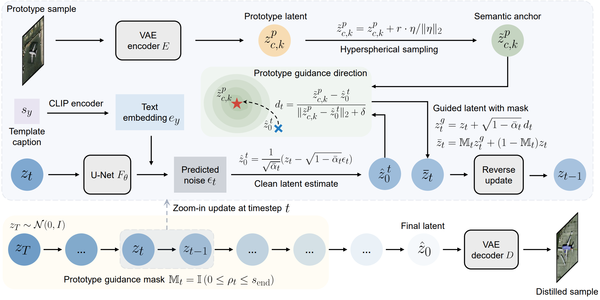
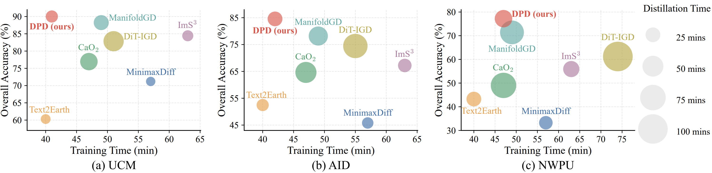

<h1 align="center">Toward Realistic Remote Sensing Dataset Distillation with Discriminative Prototype-guided Diffusion</h1>


This is the official implementation of the paper **[Toward Realistic Remote Sensing Dataset Distillation with Discriminative Prototype-guided Diffusion](https://arxiv.org/abs/2601.15829)**.
    


## Table of Contents

1. [Installation](#installation)
2. [Data Preparation](#data-preparation)
3. [Latent Diffusion Pretraining](#latent-diffusion-pretraining)
4. [Latent Prototype Extraction](#latent-prototype-extraction)
5. [Latent Classifier for Candidate Selection](#latent-classifier-for-candidate-selection)
6. [Prototype-Guided Generation](#prototype-guided-generation)
7. [Evaluation](#evaluation)
8. [Citation](#citation)
9. [Acknowledgements](#acknowledgements)
10. [License](#license)

## Installation
Install huggingface/diffusers:
```bash
conda create -n diffusers python=3.9
conda activate diffusers
git clone https://github.com/huggingface/diffusers
cd diffusers
pip install .
```

Then cd to the `examples` folder in `diffusers` and run
```bash
pip install -r requirements.txt
pip install --upgrade peft==0.15.0
```

Copy the two customized Stable Diffusion pipelines in the folder `pipelines` from this repo to the corresponding path in the `diffusers` library:
```bash
cp -f pipelines/pipeline_stable_diffusion_latents2img.py \
path/to/conda/envs/diffusers/lib/python3.9/site-packages/diffusers/pipelines/stable_diffusion/
cp -f pipelines/pipeline_stable_diffusion_gen_latents.py \
path/to/conda/envs/diffusers/lib/python3.9/site-packages/diffusers/pipelines/stable_diffusion/
```

## Data Preparation
Remote sensing datasets used in this repo:
  - [UCM dataset](https://www.kaggle.com/datasets/abdulhasibuddin/uc-merced-land-use-dataset)
  - [AID dataset](https://captain-whu.github.io/AID/)
  - [NWPU-RESISC45 dataset](https://huggingface.co/datasets/jonathan-roberts1/NWPU-RESISC45)

Expected dataset root layout:
```text
/path/to/VisionLanguage/
├── UCMerced_LandUse/
│   └── Images/...
├── AID/
│   └── ...
└── NWPU-RESISC45/
    ├── train/...
    └── test/...
```

Prepare image-caption metadata for the real training split. Replace `UCM` with `AID` or `NWPU` as needed.
```bash
python caption.py \
  --dataset UCM \
  --src_root /path/to/VisionLanguage/ \
  --dst_root /path/to/VisionLanguage/Caption/
```

This creates:
```text
/path/to/VisionLanguage/Caption/UCM/train/
├── image files
└── metadata.jsonl
```

## Latent Diffusion Pretraining
Fine-tune `Stable Diffusion 2` (initialized by `Text2Earth`) with LoRA. Replace `UCM` with `AID` or `NWPU` as needed.
```bash
accelerate launch \
  --mixed_precision=bf16 \
  train_text_to_image_lora.py \
  --pretrained_model_name_or_path lcybuaa/Text2Earth \
  --train_data_dir=/path/to/VisionLanguage/Caption/UCM/train \
  --resolution=256 \
  --train_batch_size=8 \
  --max_train_steps=20000 \
  --learning_rate=5e-4 \
  --lr_scheduler=constant_with_warmup \
  --lr_warmup_steps=200 \
  --seed=666 \
  --validation_steps=5000 \
  --num_validation_images=1 \
  --validation_prompt \
    'A satellite image of airplane' \
    'A satellite image of forest' \
    'A satellite image of river' \
    'A satellite image of parking lot' \
    'A satellite image of sparse residential area' \
  --output_dir=./trained_lora/dpd_pretrain_20k/UCM/dpd-pretrain-1gpuA100-res256-lr5em4-snr5p0-warm200-bs8-max20000 \
  --report_to=wandb \
  --checkpointing_steps=20000 \
  --checkpoints_total_limit=1 \
  --allow_tf32 \
  --dataloader_num_workers=4 \
  --snr_gamma=5.0
```

We also provide the pretrained LoRA weights in the `trained_lora` folder of this repository.

## Latent Prototype Extraction
Extract IPC prototypes from the real training set using VAE latents. Replace `UCM` with `AID` or `NWPU` as needed, and set `--n_clusters` to 5, 10, 15, or 20 for different IPC settings. Here, `--n_clusters` specifies the target IPC.
```bash
python clustering.py \
  --dataset UCM \
  --root_dir /path/to/VisionLanguage/ \
  --output_root ./prototypes \
  --n_clusters 20
```

## Latent Classifier for Candidate Selection
```bash
python train_cls_latent.py \
  --dataset UCM \
  --root_dir /path/to/VisionLanguage/
```
We also provide the pretrained latent classifier weights in the `pretrain` folder of this repository.

## Prototype-Guided Generation
```bash
python gen_image.py \
  --dataset UCM \
  --mode prototype \
  --IPC 20 \
  --lora_dir ./trained_lora/dpd_pretrain_20k/UCM/ \
  --output_dir ./generated_data/DPD \
  --image_root /path/to/VisionLanguage/ \
  --prototypes_dir ./prototypes \
  --use_prototype_guidance \
  --num_candidates_per_prototype 5 \
  --candidate_batch_size 5 \
  --selection_metric target_logit_margin \
  --latent_classifier_ckpt ./pretrain/UCM/latent_classifier.pth \
  --num_generation_repeats 5
```
Generated data are saved in `./generated_data/DPD/UCM`.

<p align="center">
  
</p>

## Evaluation

### Classification Accuracy
Train classifiers on the distilled dataset and evaluate on the original test split:
```bash
python test.py \
  --dataset UCM \
  --mode prototype \
  --IPC 20 \
  --root_dir /path/to/VisionLanguage/ \
  --sd_root ./generated_data/DPD \
  --setting_tag prototype-guidance-s1-g0p0-0p8-select-target_logit_margin-r5 \
  --network resnet18 \
  --num_generated_sets 5
```

### FID
First train the dataset-specific Inception-v3 feature extractor:
```bash
python pretrain_inception.py \
  --dataset UCM \
  --root_dir /path/to/VisionLanguage/ \
  --output_dir ./pretrain
```

Then compute FID:
```bash
python fid_score.py \
  --sd_root ./generated_data/DPD \
  --setting_tag prototype-guidance-s1-g0p0-0p8-select-target_logit_margin-r5 \
  --dataset UCM \
  --mode prototype \
  --IPC 20 \
  --root_dir /path/to/VisionLanguage/ \
  --pretrain_dir ./pretrain \
  --num_generated_sets 5
```

### CLIP Score and Zero-Shot CLIP Accuracy
```bash
python clip_score.py \
  --sd_root ./generated_data/DPD \
  --setting_tag prototype-guidance-s1-g0p0-0p8-select-target_logit_margin-r5 \
  --dataset UCM \
  --mode prototype \
  --IPC 20 \
  --num_generated_sets 5
```

### Intra-Class Coverage
```bash
python ic_coverage.py \
  --sd_root ./generated_data/DPD \
  --setting_tag prototype-guidance-s1-g0p0-0p8-select-target_logit_margin-r5 \
  --dataset UCM \
  --mode prototype \
  --IPC 20 \
  --root_dir /path/to/VisionLanguage/ \
  --num_generated_sets 5 \
  --csv_file ./coverage_summary.csv
```

### NN-SSIM
```bash
python nn_ssim.py \
  --distilled_dir ./generated_data/DPD/UCM/prototype/prototype-guidance-s1-g0p0-0p8-select-target_logit_margin-r5-gid1/IPC_5 \
  --dataset UCM \
  --IPC 20 \
  --root_dir /path/to/VisionLanguage/
```

## Citation
If this work is useful for your research, please cite:
```bibtex
@article{xu2026dpd,
  title={Toward Realistic Remote Sensing Dataset Distillation with Discriminative Prototype-guided Diffusion},
  author={Xu, Yonghao and Ghamisi, Pedram and Weng, Qihao},
  journal={IEEE Transactions on Geoscience and Remote Sensing},
  year={2026}
}
```

## Acknowledgements
- [diffusers](https://github.com/huggingface/diffusers)
- [D4M](https://github.com/suduo94/D4M)
- [Text2Earth](https://huggingface.co/lcybuaa/Text2Earth)


## License
This repo is distributed under [Apache License](https://github.com/YonghaoXu/DPD/blob/main/LICENSE). The code is for academic use only.